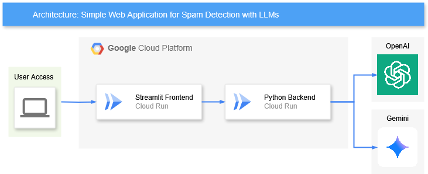

# AI Engineer Take-Home Assessment Deploy

This project features a simple web application designed to demonstrate and deploy the solution of the take-home assessment. The solution is modular and easily scalable, combining an intuitive user interface with a robust and efficient backend architecture.

You can acess and interact with the application with the following link:
https://streamlit-app-314766854658.us-east1.run.app/

## Solution Overview

This application is divided into two main parts, each with a well-defined function and organized in its own folder:

* **Front-end:** Developed with Streamlit, this component provides a user-friendly graphical interface. It acts as the "entry point" for the user, allowing to input any e-mail content and visualize the classification results. Its files are located in the streamlit folder.

* **Back-end:** This layer, built in Python, uses the solutions.py file from my challenge's answer to function as an API. It receives requests from the Streamlit front-end, processes the data, calls the inference models (OpenAI or Gemini), and returns the results. Its files are in the model_inference folder.

## Solution Architecture

The architecture was designed to be decoupled and scalable, with each component functioning independently. The data flow is as follows: the user interacts with the front-end, which sends a request to the back-end, which in turn processes the request and returns the result.

## Deployment

To ensure high availability and scalability, both services (the Streamlit front-end and the inference back-end) have been containerized with Docker. They are deployed on Google Cloud using Cloud Run. This serverless approach allows the services to automatically scale from zero to hundreds of instances as needed, optimizing both cost and performance.

## Architecture Diagram

  

